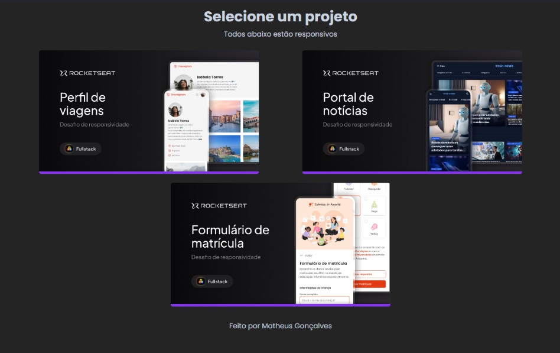

 
Desafio prático - Adicionando responsividade em projetos realizados durante o curso.

  <a href="#-tecnologias">Tecnologias</a>&nbsp;&nbsp;&nbsp;|&nbsp;&nbsp;&nbsp;
  <a href="#-descrição">Descrição do projeto</a>

 

  

## Tecnologias

Esse projeto foi desenvolvido com as seguintes tecnologias:

- HTML
- CSS

## Descrição

  Transformei layouts que ainda não estão responsivos em layouts responsivos.

