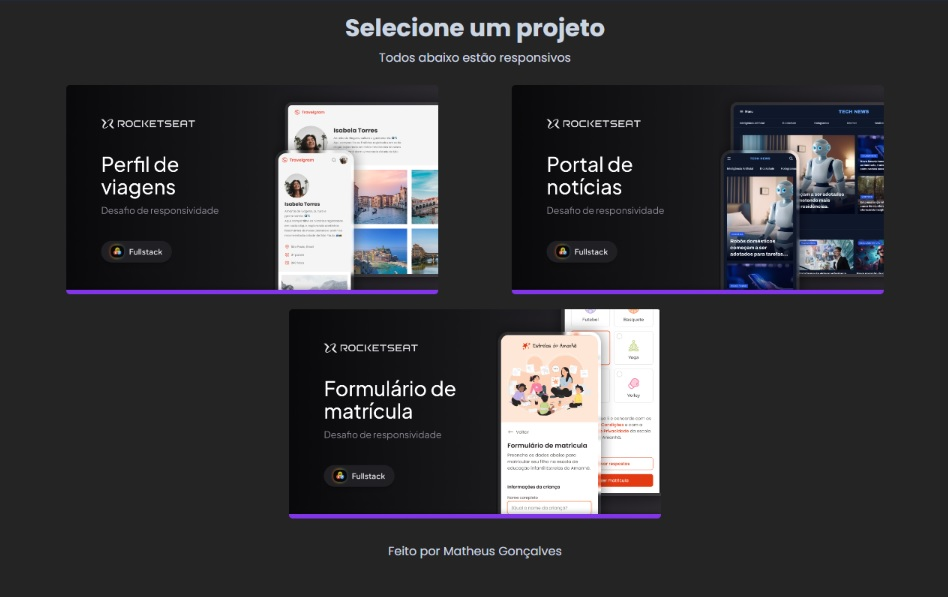

# 📱 Projetos Responsivos

 

Desafio prático de responsividade aplicando técnicas de layout moderno em páginas previamente desenvolvidas durante o curso.

O objetivo foi adaptar interfaces originalmente desktop-only para diferentes tamanhos de tela (mobile, tablet e desktop), garantindo boa experiência de uso em qualquer dispositivo.

---

## 🔎 O que foi trabalhado

* Mobile First
* Media Queries
* Flexbox
* CSS Grid
* Adaptação de imagens e containers
* Correção de overflow e alinhamento
* Estados de interação (hover/focus)

---

## 🚀 Tecnologias

* HTML5
* CSS3

A---

## 💻 Projeto

Foram adaptadas três interfaces:

* Perfil de viagens
* Portal de notícias
* Formulário de matrícula

Todos os layouts funcionam corretamente em telas pequenas e grandes, mantendo hierarquia visual e legibilidade.

---

## 🎯 Objetivo

Praticar conceitos fundamentais de responsividade utilizados no desenvolvimento front-end profissional, simulando situações reais de ajuste de layout para múltiplos dispositivos.
